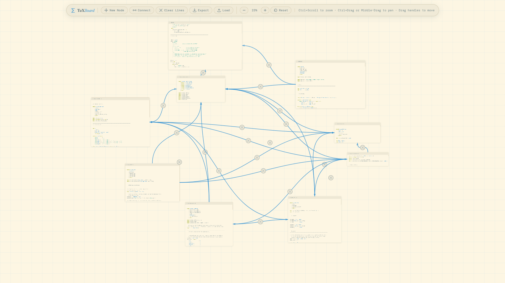

# TeX Board

A minimal infinite-canvas whiteboard for writing and connecting LaTeX and Code nodes. Built with TypeScript and Vite; renders math via KaTeX.



---

## Features

- **LaTeX nodes** — each node has a title and a textarea. Type `$…$` or `$$…$$` (and `\(…\)`, `\[…\]`, `\begin{…}`) and the preview renders live via KaTeX. Plain text is left untouched.
- **Infinite canvas** — pan and zoom freely; nodes stay fixed in canvas space at any scale.
- **Connections** — drag from any of a node's four directional dots to another node to draw a direction-aware cubic Bézier arrow. Click the midpoint button to delete a connection.
- **Export / Load** — save the full board to a `.json` file and restore it later, including node positions, sizes, content, and all connections.

---

## Getting started

**Prerequisites:** Node.js 18+ and npm.

```bash
# 1. Install dependencies
npm install

# 2. Start the dev server
npm run dev
```

Open `http://localhost:5173` in your browser.

```bash
# Build for production
npm run build

# Preview the production build locally
npm run preview
```

---

## Usage

### Adding and editing nodes

Click **New Node** (or press `N`) to create a node at the centre of the current view. Click the preview area of any node to open the editor. Click away or press `Tab` to close it and render the math.

Each node has an editable title in the header bar. Nodes can be resized by dragging the bottom-right corner of the editor area.

### Writing LaTeX

Only content inside explicit delimiters is rendered as math. Plain text is passed through as-is.

| Syntax | Result |
|---|---|
| `$E = mc^2$` | Inline math |
| `$$\int_0^\infty e^{-x^2} dx$$` | Display math (centred) |
| `\( \vec{F} = m\vec{a} \)` | Inline math (alternate) |
| `\[ \nabla \cdot \vec{E} = \frac{\rho}{\varepsilon_0} \]` | Display math (alternate) |
| `\begin{align} … \end{align}` | Aligned equations |
| `Plain text` | Rendered as plain text |

Mixed content works too — for example, `The solution is $x = \frac{-b \pm \sqrt{b^2 - 4ac}}{2a}$.` renders the sentence with the formula inline.

### Connecting nodes

Hover a node to reveal the four connection dots (top, right, bottom, left). Drag from any dot to another node (or another dot on another node) to create a connection. The curve automatically picks the shortest dot pair and updates as nodes are moved. Click the **×** button at the midpoint of a connection to remove it.

### Navigating the canvas

| Action | How |
|---|---|
| Zoom in / out | `Ctrl + Scroll` |
| Pan | `Ctrl + Drag`, `Middle-click drag`, or `Space + Drag` |
| Reset view | `R`, or click the zoom percentage |
| Zoom in (button) | `+` / `=` |
| Zoom out (button) | `-` |

### Keyboard shortcuts

| Key | Action |
|---|---|
| `N` | New node |
| `C` | Toggle connect mode |
| `Escape` | Exit connect mode |
| `+` / `=` | Zoom in |
| `-` | Zoom out |
| `R` | Reset view to 100% |
| `Ctrl + S` | Export board |

### Saving and loading

Click **Export** (or press `Ctrl+S`) to download a `texboard-YYYYMMDD-HHmm.json` file containing all nodes and connections. Click **Load** to open a previously saved file. Loading replaces the current board entirely.

The JSON format is stable and versioned (`"version": 1`):

```json
{
  "version": 1,
  "nodes": [
    {
      "id": "uuid",
      "title": "Node A",
      "content": "The energy $E = mc^2$.",
      "x": 160,
      "y": 180,
      "width": 300,
      "height": 150
    }
  ],
  "connections": [
    { "fromId": "uuid-a", "toId": "uuid-b" }
  ]
}
```

---

## Architecture notes

**Coordinate systems.** Nodes live inside `#canvas-layer`, a single `<div>` that receives a CSS `transform: translate(panX, panY) scale(scale)`. Node positions are stored as canvas-local pixels (`left`/`top`). The SVG overlay is `position: fixed` and draws connection paths in screen-space pixels obtained via `getBoundingClientRect`, so connections always align with nodes regardless of the current pan/zoom.

**Node identity.** Each node gets a UUID assigned by `attachEditorEvents` (`crypto.randomUUID()`). This UUID is the stable key used by the persistence layer to re-wire connections on load.

**KaTeX integration.** `renderMath` uses KaTeX's `auto-render` extension to process delimiters in the node preview. Only the preview `<div>` of the node being edited is re-rendered, avoiding a full-page pass. Delimiters include standard `$…$`, `$$…$$`, `\(…\)`, and `\[…\]`.

---